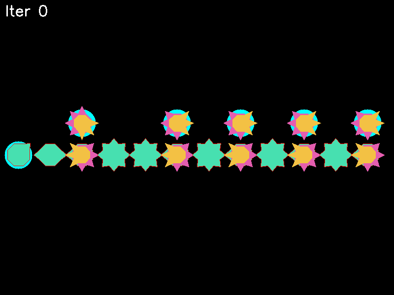

A MultiLayer Mutilated Gear system is a project, designed to emulate a mechanical component of a multi-layered mutilated gear system. Each layer of the gear can have some of teeth and miss others, a full grid is capable to represent logic

Run main.py to see UI.

```python main.py```

Run grid_editor.py to see geenrate all grid examples.

```python grid_editor.py```

Examples:

**Wire**


